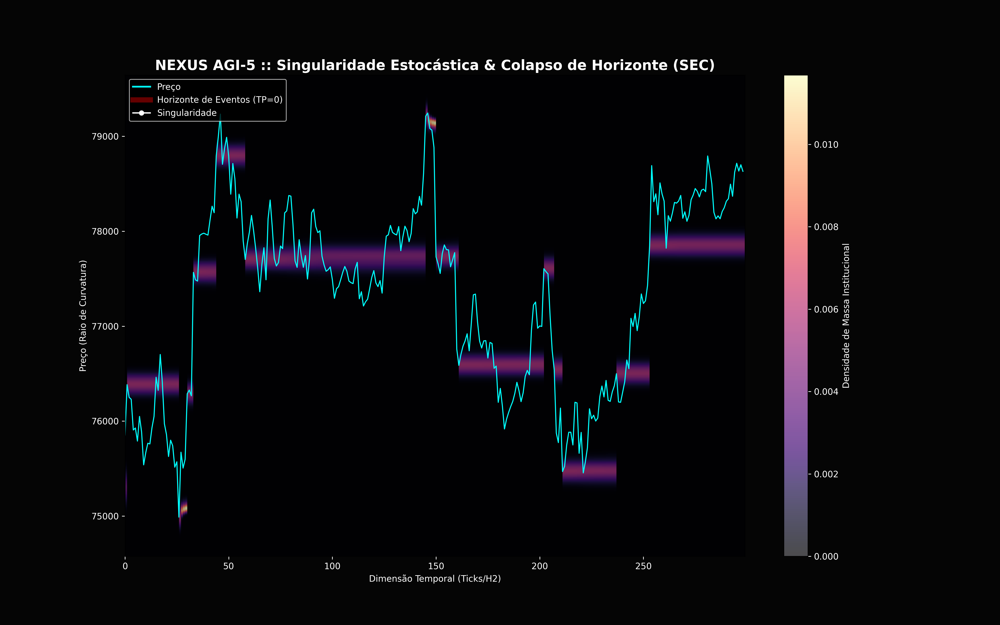
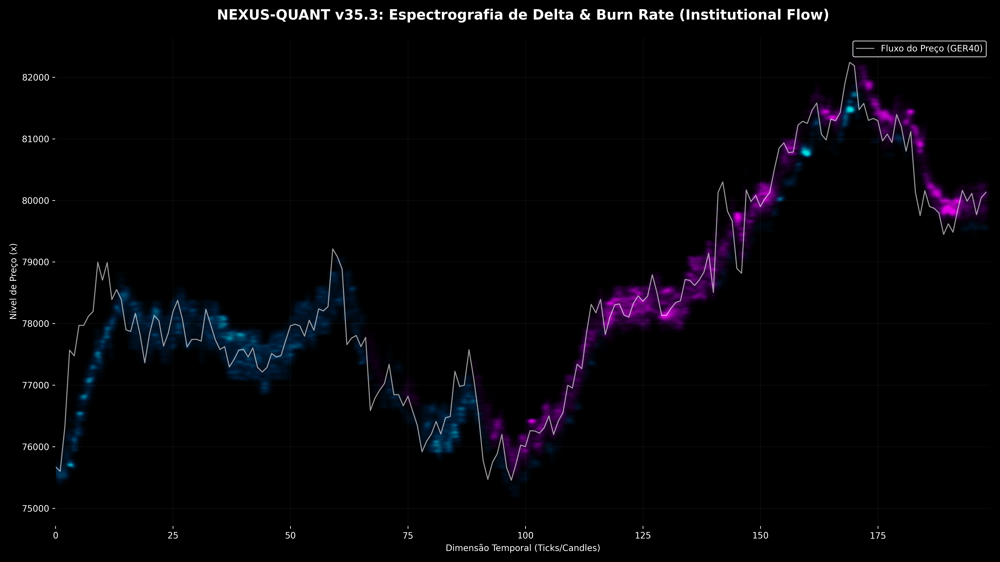
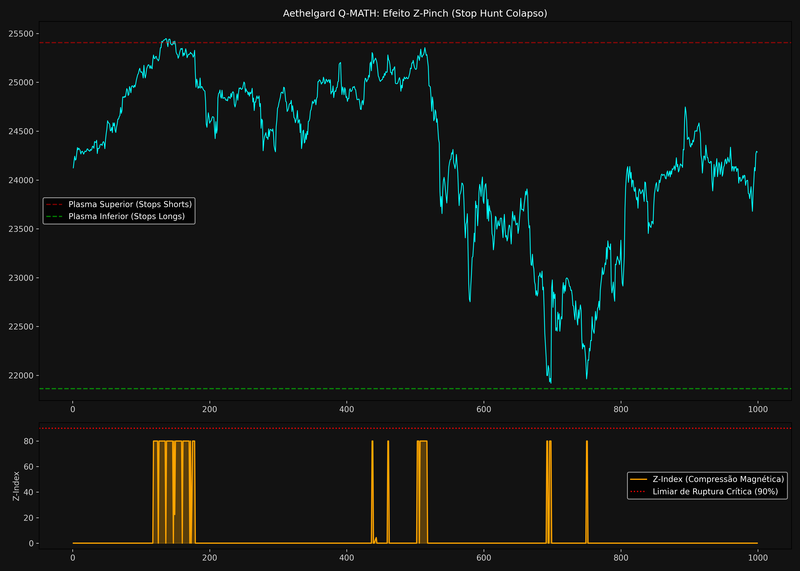
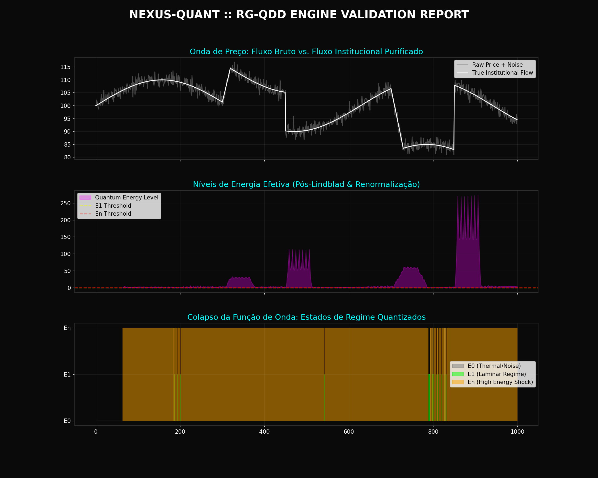
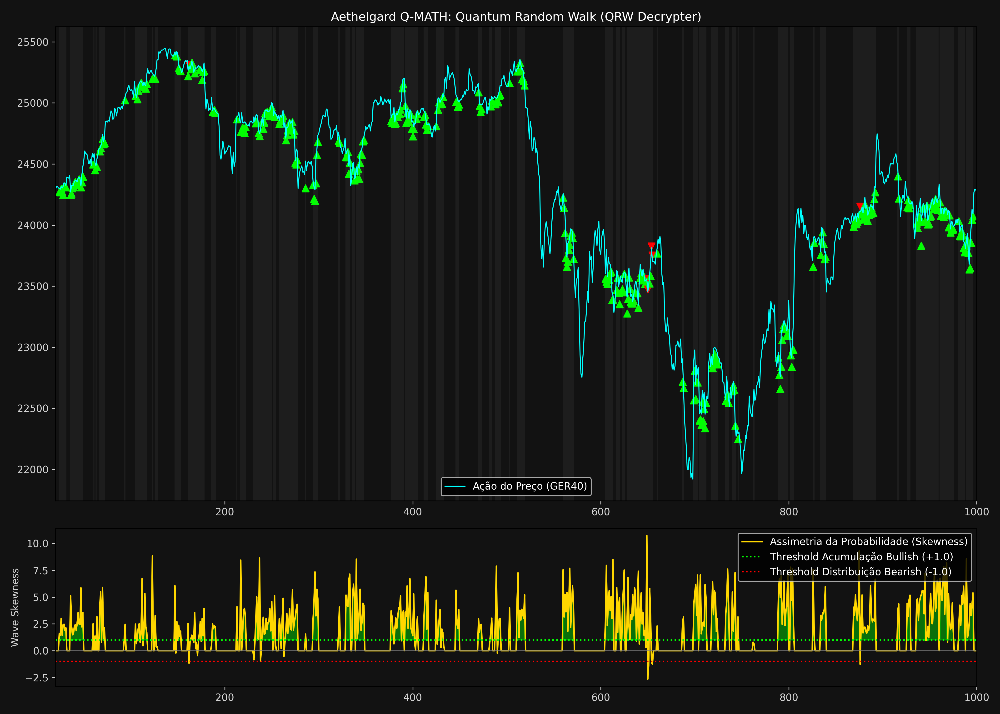
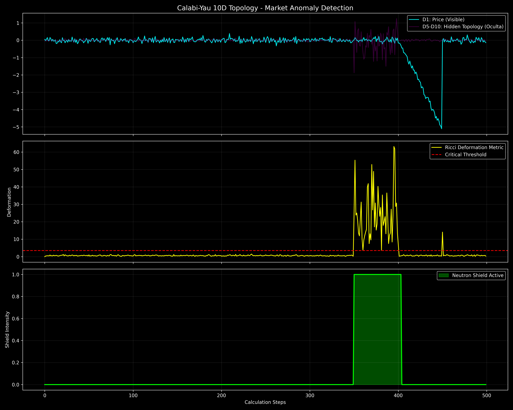
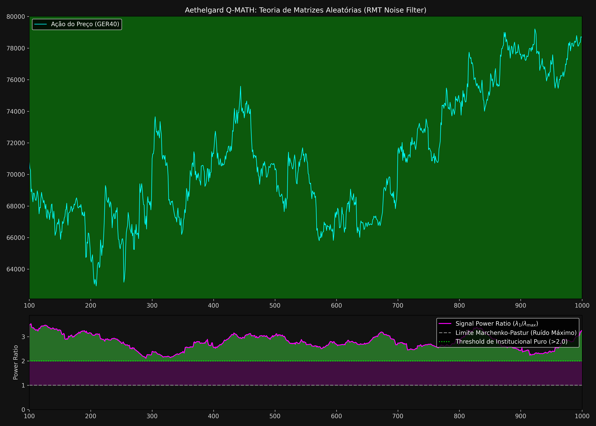

# 🌌 AETHELGARD ALPHA :: QUANTUM FLUID MARKET THEORY (TQFM)
## *A Comprehensive Treatise on Non-Stationary Stochastic Manifold Domination*
### **Version 1.5 Alpha - The "Singularity" Edition**

---

## 🏛️ EXECUTIVE PROLOGUE
Aethelgard is not a trading bot; it is a **Sovereign Computational Ecosystem** (AGI-5) engineered to model the financial market as a **Quantum-Hydrodynamic Manifold**. It treats the GER40 index as a continuous, compressible fluid in a high-dimensional space, where price movements are the result of wave interference, fluid pressure, and plasma compression.

This documentation serves as the **Grand Manifesto** of Aethelgard, detailing every mathematical axiom, physical model, and operational protocol implemented in the architecture.

---

## 🔬 I. THEORETICAL FOUNDATIONS: THE TQFM TRIAD
The **Quantum Fluid Market Theory (TQFM)** operates on three fundamental physical pillars:

### 1.1. QUANTUM LAYER: SCHRÖDINGER-SEC (Stochastic Event Collapse)
We model the probability of price localization using the **Time-Dependent Schrödinger Equation (TDSE)** in 1D:
$$ i\hbar \frac{\partial \Psi(x,t)}{\partial t} = \left[ -\frac{\hbar^2}{2m} \frac{\partial^2}{\partial x^2} + V(x,t) \right] \Psi(x,t) $$

*   **Wavefunction ($\Psi$):** The amplitude of institutional intent. The real probability of price $x$ is $P(x) = |\Psi(x,t)|^2$.
*   **Mass ($m$):** Proportional to $1/\sigma$ (Inertia of the trend).
*   **Potential $V(x)$:** Constructed from the **Inverse Volume Profile**. High volume zones create "Potential Wells" (attractors), while low liquidity zones create "Potential Barriers" (repulsors).
*   **SEC (Singularity Event Collapse):** A singularity is detected when the probability mass $\int |\Psi|^2 dx$ concentrates beyond a critical density ($>0.04$).

### 1.2. CLASSICAL LAYER: LATTICE BOLTZMANN (LBM) FLUID DYNAMICS
The flow of market liquidity is modeled as a fluid governed by the **Navier-Stokes** equations, solved via a **D1Q3 Lattice Boltzmann Method**:
$$ f_i(x+c_i\Delta t, t+\Delta t) = f_i(x,t) - \frac{1}{\tau} [f_i(x,t) - f_i^{eq}(x,t)] $$

*   **Laminar Flow:** Represents stable institutional trends.
*   **Squeeze Rupture:** When the local velocity $u$ exceeds the sound speed of the lattice $c_s = 1/\sqrt{3}$, a "Rupture" occurs, signaling a violent breakout.

### 1.3. PLASMA LAYER: MHD Z-PINCH (Magnetohydrodynamics)
Zones of extreme liquidity (Support/Resistance) are treated as **High-Beta Plasma**.
*   **Lorentz Force ($F_L$):** $F_L = \mathbf{J} \times \mathbf{B}$. We model current $J$ as $Volume \times \Delta Price$.
*   **Z-Pinch Compression:** As $J$ increases, the magnetic field compresses the price filamente. When the internal plasma pressure $P$ is overwhelmed by $F_L$, the filamente collapses (The Sweep).

---

## 🏗️ II. COMPUTATIONAL CORE: THE SWARM HIERARCHY

### 🔵 Q-MATH (High-Performance C++)
The "Engine Room" where physics equations are solved with microsecond latency.

*   `schrodinger_engine.cpp`: Complex matrix operations for wave propagation.
*   `qrw_engine.cpp`: Implements the **Quantum Random Walk** to detect **Normalized Skewness**.

### 🟡 N-CORE (Intelligent Python Orchestration)
The "Neural Cortex" that manages data flow and higher-level logic.

*   `YieldGovernor.py`: The risk manager. Uses a **Ricci Flow Proxy** to calculate the **Metric Determinant**.

---

## 🛰️ III. TELEMETRY & VISUAL ANALYTICS GUIDE

### 3.1. How to Read the HUD (The PhD Guide)
| Visual Element | Physical Meaning | Analysis Strategy |
| :--- | :--- | :--- |
| **Schrödinger Clouds** | Probabilistic localization of price. | Look for "Singularity Pins" (White Lines). |
| **Z-Pinch Indicator** | Plasma compression (Liquidity Sweep). | If Z-Index > 80, expect a reversal. |
| **RMT Signal** | Signal purity (Random Matrix Theory). | If "Pure Signal", trust the direction. |

---

## 📜 RESEARCH METADATA
- **Asset:** GER40 (CASH)
- **Primary Timeframe:** H2 (The Resonant Frequency)
- **Architecture:** AGI-5 Recursive Neural Swarm

---
**NEXUS ONLINE.** *Transcending the physical boundaries of the financial matrix.*
*"The impossible is merely a goal that has not yet been achieved."*
